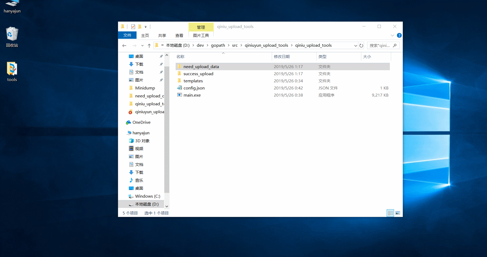

#### [qiniuyun_upload_tools](https://github.com/Han-Ya-Jun/qiniuyun_upload_tools)
最近写博客发现经常要上传图片到七牛云上去，每次打开网页登录然后上传感觉很慢，windows也没有一个好的上传工具，于是写了这样的一个工具。
#### 效果

#### 使用方法
- 下载程序包[点击下载](https://github.com/Han-Ya-Jun/qiniuyun_upload_tools/releases/download/1.0.0/qiniu_upload_tools.zip)
- 解压后直接在config.json文件里面天上自己七牛云相关的信息。<br>
config
```json
{
    "access_key": "************", 
    "secret_key": "***************", 
    "zone": 0,                                     
    "Bucket": "hanyajun",                        
    "use_https": false,
    "use_cdn_domains":false,
    "domain": "http://cdn.hanyajun.com/"
}
```
注：
- zone: 空间对应的机房-- 0:华东, 1:华北, 2:华南, 3:北美
- Bucket：空间的名字
- use_https: 是否使用https域名
- use_cdn_domains: 上传是否使用CDN上传加速
- domain: 绑定的域名
#### to do
尝试实现GUI界面操作，可以批量选择图片然后也可以粘贴图片上传
